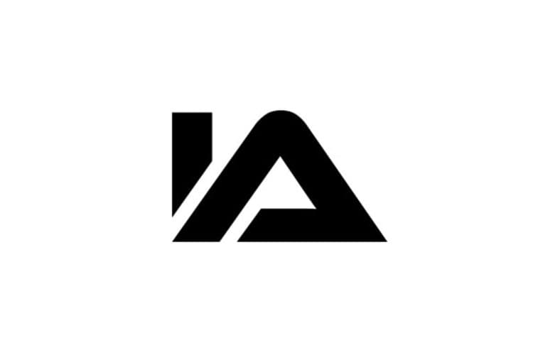
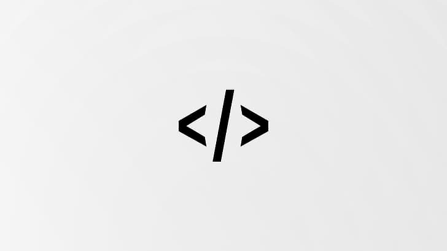

# ¡Hola! 👋 Soy IADEV

  

  

## 🎓 Sobre mí

Estudiante de la Universidad Católica Andrés Bello (UCAB) en Bolívar, Venezuela. Me especializo en desarrollo Frontend y Middleware, con pasión por crear experiencias de usuario excepcionales.

## 💻 Stack Tecnológico

## 🌟 Áreas de Enfoque

- 🎨 **Frontend Development**
  - Desarrollo de interfaces modernas y responsivas
  - Optimización de rendimiento
  - Accesibilidad web

- 🔄 **Middleware Development**
  - Integración de sistemas
  - APIs y servicios web
  - Arquitectura de software

## 🎨 UCAB Colors

  

  

## 📊 Estadísticas de GitHub

  

## 📫 Contacto

¿Interesado en colaborar? ¡No dudes en contactarme!

  

---

  

